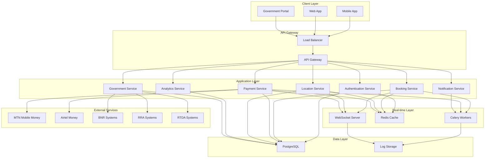
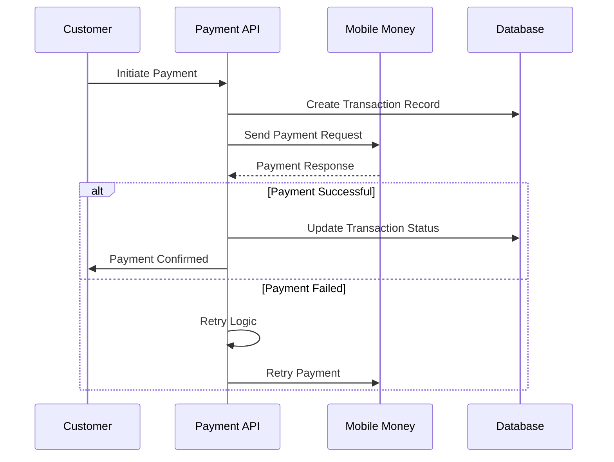
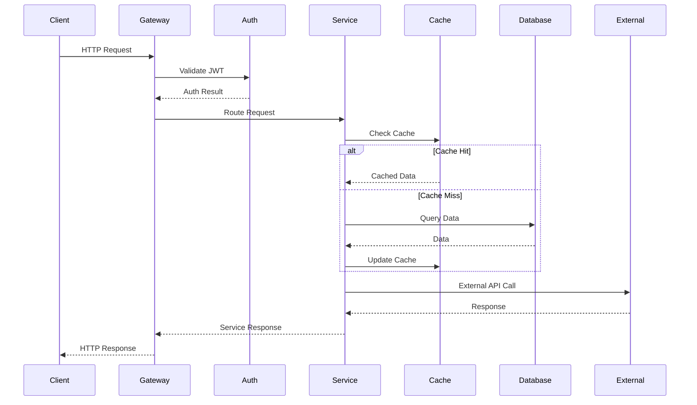
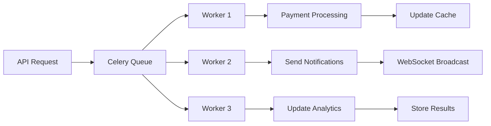
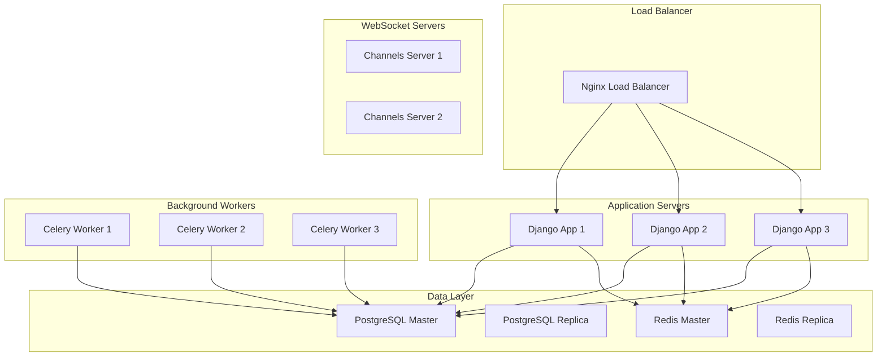

# SafeBoda Rwanda Platform - System Architecture

## 🏗️ Architecture Overview

SafeBoda Rwanda is a comprehensive ride-booking platform built with Django REST Framework, designed for the Rwanda market with integrated mobile money payments, government compliance, and real-time tracking capabilities.

### 🎯 Design Principles

- **Microservices-oriented**: Modular app structure with clear service boundaries
- **Async-first**: Leveraging Python async/await for high-performance operations
- **Rwanda-focused**: Built specifically for Rwanda's regulatory and business environment
- **Scalable**: Designed to handle growing user base and transaction volume
- **Compliant**: Government regulatory compliance built-in from the ground up

## 📊 High-Level Architecture



## 🏛️ Service Architecture

### Core Services

#### 1. Authentication Service (`authentication/`)
**Purpose**: User management, authentication, and authorization

**Components**:
- JWT-based authentication with refresh tokens
- Role-based access control (Customer, Driver, Admin, Government)
- Phone number-based registration (Rwanda format)
- Driver onboarding and verification
- User profile management

**Key Features**:
- Rwanda phone number validation (`+250XXXXXXXXX`)
- Multi-language support (English, Kinyarwanda, French)
- Driver license verification
- Government official access control

#### 2. Booking Service (`bookings/`)
**Purpose**: Core ride booking and management functionality

**Components**:
- Integrated booking workflow (`integrated_service.py`)
- Enhanced async API views (`enhanced_views.py`)
- Ride state management
- Driver matching algorithm
- Fare calculation

**Async Workflow**:
```python
async def create_booking(booking_data):
    # 1. Validate pickup/destination
    await validate_locations(booking_data)
    
    # 2. Calculate fare
    fare = await calculate_fare(booking_data)
    
    # 3. Find available drivers
    drivers = await find_nearby_drivers(booking_data)
    
    # 4. Create booking record
    booking = await create_booking_record(booking_data, fare)
    
    # 5. Send driver notifications
    await notify_drivers(drivers, booking)
    
    # 6. Initialize payment
    await initialize_payment(booking)
    
    # 7. Start real-time tracking
    await start_tracking(booking)
    
    return booking
```

#### 3. Payment Service (`payments/`)
**Purpose**: Mobile money integration and payment processing

**Components**:
- Async payment processor (`async_processor.py`)
- MTN Mobile Money integration
- Airtel Money integration
- Payment retry logic and error handling
- Transaction reconciliation

**Payment Flow**:


#### 4. Location Service (`locations/`)
**Purpose**: Real-time location tracking and routing

**Components**:
- Real-time tracking API (`realtime_views.py`)
- WebSocket integration for live updates
- Location history management
- Route calculation and ETA
- Driver positioning

**Real-time Features**:
- WebSocket connections for live tracking
- Redis-based location caching
- Geofencing for pickup/destination areas
- Route optimization

#### 5. Analytics Service (`analytics/`)
**Purpose**: Business intelligence and reporting

**Components**:
- Core analytics endpoints (6 required)
- Administrative reporting (`admin_views.py`)
- Government compliance reports
- Performance metrics
- Revenue analytics

**Reporting Categories**:
- Ride pattern analysis
- Driver performance metrics
- Revenue and financial analytics
- Government compliance reports
- Customer behavior insights

#### 6. Government Service (`government/`)
**Purpose**: Regulatory compliance and government integration

**Components**:
- BNR (Bank of Rwanda) reporting
- RRA (Rwanda Revenue Authority) tax compliance
- RTDA (Rwanda Transport Development Agency) licensing
- Audit trail management
- Compliance monitoring

## 🔄 Data Flow Architecture

### Request Flow



### Async Processing Flow



## 🗄️ Database Architecture

### PostgreSQL Schema Design

```sql
-- Core Tables
CREATE TABLE users (
    id UUID PRIMARY KEY,
    phone_number VARCHAR(15) UNIQUE,
    first_name VARCHAR(100),
    last_name VARCHAR(100),
    user_type VARCHAR(20),
    created_at TIMESTAMP,
    is_active BOOLEAN
);

CREATE TABLE driver_profiles (
    id UUID PRIMARY KEY,
    user_id UUID REFERENCES users(id),
    license_number VARCHAR(50),
    vehicle_plate_number VARCHAR(20),
    license_expiry_date DATE,
    status VARCHAR(20),
    average_rating DECIMAL(3,2)
);

CREATE TABLE rides (
    id UUID PRIMARY KEY,
    customer_id UUID REFERENCES users(id),
    driver_id UUID REFERENCES users(id),
    pickup_latitude DECIMAL(10,8),
    pickup_longitude DECIMAL(11,8),
    destination_latitude DECIMAL(10,8),
    destination_longitude DECIMAL(11,8),
    status VARCHAR(20),
    total_fare DECIMAL(10,2),
    payment_method VARCHAR(20),
    created_at TIMESTAMP,
    completed_at TIMESTAMP
);

CREATE TABLE transactions (
    id UUID PRIMARY KEY,
    ride_id UUID REFERENCES rides(id),
    amount DECIMAL(10,2),
    currency VARCHAR(3),
    provider VARCHAR(20),
    external_transaction_id VARCHAR(100),
    status VARCHAR(20),
    created_at TIMESTAMP
);

-- Indexes for Performance
CREATE INDEX idx_rides_customer_created ON rides(customer_id, created_at);
CREATE INDEX idx_rides_driver_created ON rides(driver_id, created_at);
CREATE INDEX idx_rides_status ON rides(status);
CREATE INDEX idx_transactions_status ON transactions(status);
CREATE INDEX idx_users_phone ON users(phone_number);
```

### Caching Strategy

**Redis Cache Layers**:

1. **Session Cache**: JWT tokens and user sessions
2. **Location Cache**: Real-time driver positions
3. **Analytics Cache**: Frequently accessed reports
4. **Payment Cache**: Transaction status updates

```python
# Cache Configuration
CACHE_TIMEOUTS = {
    'user_session': 86400,      # 24 hours
    'driver_location': 60,      # 1 minute
    'analytics_report': 1800,   # 30 minutes
    'payment_status': 300,      # 5 minutes
}
```

## 🔧 Technology Stack

### Backend Technologies
- **Framework**: Django 4.2 + Django REST Framework
- **Language**: Python 3.11 with async/await
- **Database**: PostgreSQL 15
- **Cache**: Redis 7
- **Message Queue**: Celery with Redis broker
- **WebSocket**: Django Channels

### External Integrations
- **Mobile Money**: MTN Mobile Money API, Airtel Money API
- **Government**: BNR, RRA, RTDA systems
- **Monitoring**: Custom monitoring integration
- **Logging**: Structured logging with correlation IDs

### Development Tools
- **API Documentation**: drf-spectacular (OpenAPI 3.0)
- **Testing**: pytest with async support
- **Code Quality**: black, flake8, mypy
- **Deployment**: Docker containerization

## 🚀 Deployment Architecture

### Development Environment
```yaml
services:
  web:
    build: .
    ports:
      - "8000:8000"
    environment:
      - DJANGO_SETTINGS_MODULE=safeboda_rwanda.settings.development
    depends_on:
      - postgres
      - redis

  postgres:
    image: postgres:15
    environment:
      POSTGRES_DB: safeboda_dev
      POSTGRES_USER: safeboda
      POSTGRES_PASSWORD: dev_password

  redis:
    image: redis:7-alpine
    ports:
      - "6379:6379"

  celery:
    build: .
    command: celery -A safeboda_rwanda worker -l info
    depends_on:
      - postgres
      - redis
```

### Production Architecture



## 🔒 Security Architecture

### Authentication & Authorization
- **JWT Tokens**: Stateless authentication with 24-hour expiry
- **Role-Based Access**: Customer, Driver, Admin, Government roles
- **Phone Verification**: SMS-based verification for Rwanda numbers
- **API Rate Limiting**: Request throttling by user and endpoint

### Data Security
- **Encryption**: TLS 1.3 for data in transit
- **Database**: Encrypted at rest with column-level encryption for sensitive data
- **API Security**: CORS configuration, CSRF protection
- **Input Validation**: Comprehensive validation for all inputs

### Rwanda Compliance
- **Data Residency**: All data stored within Rwanda
- **Audit Logging**: Complete audit trail for government requirements
- **Privacy**: GDPR-like privacy controls adapted for Rwanda
- **Financial Compliance**: BNR regulations compliance

## 📊 Performance Considerations

### Scalability
- **Horizontal Scaling**: Stateless application design
- **Database Optimization**: Read replicas, connection pooling
- **Caching Strategy**: Multi-layer caching with Redis
- **Async Processing**: Background task processing with Celery

### Monitoring
- **Application Metrics**: Response times, error rates, throughput
- **Infrastructure Metrics**: CPU, memory, disk, network usage
- **Business Metrics**: Ride completion rates, payment success rates
- **Real-time Alerts**: Critical system alerts and notifications

### Performance Targets
- **API Response Time**: < 200ms for 95th percentile
- **Database Query Time**: < 50ms average
- **Payment Processing**: < 5 seconds end-to-end
- **Real-time Updates**: < 1 second latency

## 🔄 Integration Patterns

### Async Processing Pattern
```python
# Booking workflow with async tasks
@shared_task
async def process_booking_workflow(booking_id):
    booking = await get_booking(booking_id)
    
    # Parallel async operations
    await asyncio.gather(
        notify_driver(booking),
        initialize_payment(booking),
        start_location_tracking(booking),
        update_analytics(booking)
    )
```

### Circuit Breaker Pattern
```python
# Payment service with circuit breaker
class PaymentCircuitBreaker:
    def __init__(self, failure_threshold=5, timeout=60):
        self.failure_threshold = failure_threshold
        self.timeout = timeout
        self.failure_count = 0
        self.last_failure_time = None
        self.state = 'CLOSED'  # CLOSED, OPEN, HALF_OPEN
    
    async def call(self, payment_func, *args, **kwargs):
        if self.state == 'OPEN':
            if time.time() - self.last_failure_time > self.timeout:
                self.state = 'HALF_OPEN'
            else:
                raise ServiceUnavailableError("Payment service unavailable")
        
        try:
            result = await payment_func(*args, **kwargs)
            if self.state == 'HALF_OPEN':
                self.state = 'CLOSED'
                self.failure_count = 0
            return result
        except Exception as e:
            self.failure_count += 1
            self.last_failure_time = time.time()
            
            if self.failure_count >= self.failure_threshold:
                self.state = 'OPEN'
            
            raise
```

### Event-Driven Architecture
```python
# Event publishing for cross-service communication
class BookingEventPublisher:
    async def publish_booking_created(self, booking):
        event = {
            'event_type': 'booking.created',
            'booking_id': booking.id,
            'customer_id': booking.customer_id,
            'timestamp': timezone.now().isoformat()
        }
        await self.redis.publish('booking_events', json.dumps(event))
```

## 🚦 Future Enhancements

### Planned Features
1. **Machine Learning**: Demand prediction and dynamic pricing
2. **IoT Integration**: Vehicle telematics and driver behavior monitoring
3. **Blockchain**: Smart contracts for driver payments
4. **AI Customer Service**: Chatbot integration for customer support

### Scalability Roadmap
1. **Phase 1**: Current architecture (up to 10K daily rides)
2. **Phase 2**: Microservices split (up to 100K daily rides)
3. **Phase 3**: Event sourcing and CQRS (up to 1M daily rides)
4. **Phase 4**: Multi-region deployment (Rwanda expansion)

---

**Document Version**: 1.0  
**Last Updated**: October 17, 2025  
**Author**: SafeBoda Rwanda Platform Team